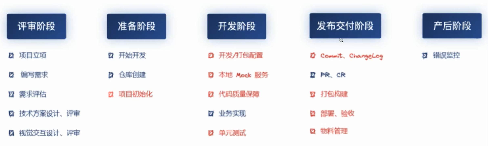

# 工程化建设

## 前端工程化发展

1、前后端分离：B/S架构兴起，有了前后端之分。

2、模块化：随着前端复杂度上升，模块复用，实践规范重要性提升。

3、自动化：管理&简化前端开发过程，前端框架、自动化、构建系统应运而生。

4、最佳实践：基于行业内最佳实践，开箱即用的框架（dva）、工具体系逐渐建立起来。

5、好、快、稳：依赖vite、esm、wasm、低代码等能力。

## 脚手架能力

### 准备阶段

1、技术选型

2、代码规范：

a、分支管理规范
b、项目初始资源规范
c、UI规范
d、物料市场规范

### 开发阶段

1、开发、打包流程

2、本地mock服务

3、代码质量

4、单元测试&E2E测试

### 发布流程

1、git commit流程

2、changeLog规范

3、打包构建

4、部署、验收